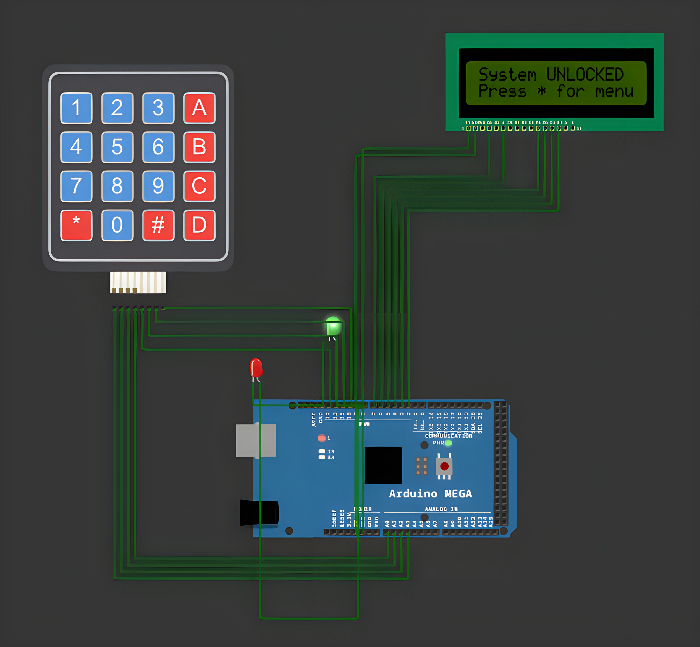

# Security System

<table align="center">
  <tr>
    <td align="center">
      
    </td>
  </tr>
</table>

## Overview

Security System is an embedded application for Arduino Mega that lets a user lock, unlock, and
manage a password-protected system by typing keypad commands, using the STDIO library for
input/output through an LCD and a 4x4 matrix keypad.

## Features

- **Keypad Command Interpreter**: Reads command sequences from the 4x4 keypad (starting with `*`
  and ending with `#`) and executes the matching action.
- **Lock / Unlock Control**: Supports unconditional lock, password-protected unlock, and password
  change commands.
- **Command Confirmation**: Replies with a clear message on the LCD after every executed command.
- **Invalid Command Handling**: Responds with an "Unknown command!" message for unrecognized
  input instead of failing silently.
- **Cross-Platform Ready**: Designed to be portable across different microcontrollers (e.g.
  Arduino, ESP32).
- **Clean Architecture**: LED control, LCD display, security logic and command interpretation are
  separated into dedicated components for readability and reuse.

## Technologies

- **Platform**: Arduino Mega
- **Language**: C++ (Arduino Framework)
- **Build System**: PlatformIO
- **Simulation**: Wokwi
- **Development Tools**: Visual Studio Code + PlatformIO IDE
- **Version Control**: Git, GitHub

## Project Structure

```
src/
├── command_handler/
│   ├── CommandHandler.cpp
│   └── CommandHandler.h
├── display/
│   ├── DisplayController.cpp
│   └── DisplayController.h
├── led/
│   ├── LEDController.cpp
│   └── LEDController.h
├── security_system/
│   ├── SecuritySystem.cpp
│   └── SecuritySystem.h
├── config.h
└── main.cpp
diagram.json
wokwi.toml
platformio.ini
```

## Commands

| Command | Action |
|---|---|
| `* 0 #` | Locks the system unconditionally |
| `* 1 * <password> #` | Unlocks the system if the password is correct |
| `* 2 * <old_password> * <new_password> #` | Changes the password (only while unlocked, min. 4 chars) |
| `* 3 #` | Shows the current system status |
| *(anything else)* | Replies with an "Unknown command!" error message |

## Resources

- [Wokwi Documentation](https://docs.wokwi.com/)
- [Arduino Debounce Tutorial](https://www.arduino.cc/en/Tutorial/Debounce)
- [Arduino Button Debouncing Techniques](https://deepbluembedded.com/arduino-button-debouncing/)
- [Getting Started with the Wokwi Arduino Simulator](https://www.digikey.com/en/maker/tutorials/2022/getting-started-with-the-wokwi-arduino-simulator)
- [Arduino ESP32 – Wokwi Documentation](https://docs.espressif.com/projects/arduino-esp32/en/latest/third_party/wokwi.html)
- [Arduino: Software Debouncing in Interrupt Function](https://www.instructables.com/Arduino-Software-debouncing-in-interrupt-function/)

## Installation

To build and run the application, follow these steps:

1. **Clone this repository:**
```bash
git clone https://github.com/Constantin-Stamate/stdio-lcd-keypad
```

2. **Navigate to the project directory:**
```bash
cd stdio-lcd-keypad
```

3. **Open the project in VS Code with the PlatformIO extension installed.**

4. **Build and upload to the board (or run the Wokwi simulation):**
```bash
pio run --target upload
```

5. **Interact via the keypad:**
```
* 1 * 1234 #   -> unlocks the system with the default password
* 0 #          -> locks the system
* 3 #          -> shows current status
```

## Contributors

**Security System** was developed as part of the Internet of Things laboratory works.

- GitHub: [Constantin-Stamate](https://github.com/Constantin-Stamate)
- Email: frimudumitru@example.com